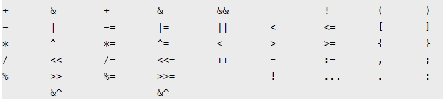

# 运算符

0110 & 1011 = 0010 AND 相同为1不同为0。 
0110 | 1011 = 1111 OR 有1得1全0为0。 
0110 ^ 1011 = 1101 XOR 相同为0不同为1。 
0110 &^ 1011 = 0100 AND NOT 按后面的1将前面的数置0。 

#### Go语言中只有a++、a--没有++a、--a，另外a++、a++不能用在赋值右边，因为他不是表达式

### 运行符优先级
| 优先级 | 运算符               |
|-----|------------------------|
| 7   | ^  \!              |
| 6   | \*  /  %  <<  >>  &  &^ |
| 5   | \+ \- \| ^        |
| 4   | == \!= < <= >= >  |
| 3   | <\-               |
| 2   | &&                |
| 1   |  \| \|             |
